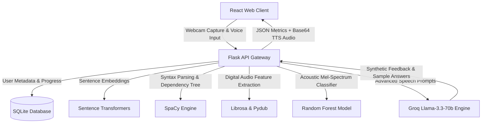

# 🛠️ SKILLFORGE: AI-Powered Skill Development & Mock Interview Platform

```
  ____  _    _ _ _  __                  
 / ___|| | _(_) | |/ _| ___  _ __  __ _  ___ 
 \___ \| |/ / | | | |_ / _ \| '__|/ _` |/ _ \
  ___) |   <| | | |  _| (_) | |  | (_| |  __/
 |____/|_|\_\_|_|_|_|  \___/|_|   \__, |\___|
                                  |___/      
```

> **Elevate your interview game with real-time vocal metrics, semantic analysis, and gamified cognitive training.** Skillforge integrates cutting-edge Natural Language Processing (NLP), Digital Signal Processing (DSP) voice analysis, and large language models (LLMs) to provide an automated, high-fidelity mock interview experience.

---

## 🏆 HACKATHON FOCUS: Job Readiness & Entrepreneurial Skill Gap

This project is specifically engineered to address the core challenges of **Job Readiness & Entrepreneurial Skills** by bridging the gap between credentials earned and capabilities demonstrated.

### 🔴 The Challenge We Address
Traditional education focuses on passive content consumption and rote-memorization testing. Many learners graduate with degrees (credentials) but struggle when asked to demonstrate applied, industry-relevant capabilities in interviews, panel discussions, or startup pitches. Skillforge shifts the paradigm from *what you know* to *how you demonstrate it*.

### 👥 Who Benefits
*   **Students & Graduates:** Accelerate self-learning through real-time feedback loops rather than waiting for human examiners.
*   **Employers:** Acquire candidates with demonstrated verbal fluency, grammatical precision, and structured critical thinking.
*   **Educational Institutions:** Deploy scalable mock assessments to measure student readiness objectively.

### 🔑 Solving Key Considerations

| Key Consideration | How Skillforge Solves It |
| :--- | :--- |
| **Employability** | Uses AI-driven vocal analytics (WPM, Jitter, RMS Energy) and vocabulary matching to groom candidates for high-stakes technical & HR interviews. |
| **Real-world Readiness** | Recreates realistic webcam panels and extracts DSP parameters (silence rates, delivery hesitation) to build confidence for actual corporate environments. |
| **Applied Learning** | Moves beyond multiple-choice tests. The Soft Skills debate room forces active speaking and argumentation on topics like AI Ethics and Sustainable Business. |
| **Entrepreneurship** | The debate engine and analytical modules nurture persuasive argumentation, quick refutation, and pitch delivery critical for startup founders. |
| **Outcome Orientation** | Includes a full gamification layer tracking coin rewards, streaks, and levels to measure incremental, demonstrated performance milestones. |

---

### 🌟 Core Hackathon Feature Upgrades (Implemented!)
*   **🌍 Language Inclusivity & Equity Layer:** Features a "Bilingual Mode (Hinglish/English)" toggle. The backend NLP engine detects transliterated Hindi/Hinglish speech and translates it using Groq before checking similarity and keyword coverage. This prevents scoring penalties for non-native English speakers.
*   **⚖️ Responsible AI Bias Shield:** Standardizes voice frequencies using relative z-score normalization over pitch frames rather than absolute standard deviation, eliminating gender pitch frequency bias and regional accent volume variations.
*   **🏆 Verifiable Skill Profiles (Proof of Capability):** Generates shareable verification scorecards (`/profile/share/:userId`) displaying candidate capability scores, progress charts, and verification hashes that recruiters can view without authenticating.
*   **📈 Placement Cell Dashboard:** Features a recruiter portal (`/institution`) letting university placement admins and employers filter student cohorts by verified AI scores in real-time.

---

## 🎯 Target Audience

- **Placement Candidates & College Students:** Perfect for engineering and management graduates aiming to crack competitive technical or behavioral placement rounds.
- **Job Seekers:** Ideal for practicing typical HR queries, elevator pitches, and domain-specific questions in a simulated webcam-recorded environment.
- **Public Speaking Enthusiasts:** Great for tracking verbal fillers (e.g., "um," "uh," "you know") and perfecting speech velocity (WPM).
- **Aptitude Aspirants:** Built for students training for cognitive and reasoning evaluation rounds.

---

## 🏗️ System Architecture

Skillforge separates frontend interface presentation from analytical computational pipelines via a decoupled client-server pattern:



---

## 🧬 Tech Stack & Library Mapping

### Frontend (React Application)
*   **Core UI Engine:** `react` (v19) & `react-router-dom` for component-level routing.
*   **Design & Theme System:** `@mui/material` & `@mui/icons-material` for a modern, sleek interface.
*   **Motion & Physics:** `framer-motion` for fluid transitions and micro-interactions, `react-tsparticles` & `tsparticles` for interactive network node background animations.
*   **Hardware Interface:** `react-webcam` for secure local camera feeds.
*   **Data Visualization:** `chart.js` & `react-chartjs-2` to render radar, line, and bar performance history.
*   **Build Bundler Overrides:** `react-app-rewired` to re-bind Webpack configuration targets.

### Backend (Python Server)
*   **REST API Gateway:** `flask` + `flask-cors` + `flask-jwt-extended` for secure authentication scopes.
*   **Semantic Matching:** `sentence-transformers` utilizing the lightweight, highly-accurate `all-MiniLM-L6-v2` transformer model.
*   **NLP & Grammar Syntax Analyzer:** `spacy` with the `en_core_web_sm` pipeline for parts-of-speech (POS) tagging and Dependency Tree Parsing.
*   **Speech Signal Processing (DSP):** `librosa` for audio spectrum analyses (MFCC, RMS energy, beat tracking) and `pydub` for audio manipulation.
*   **Speech Machine Learning Classifier:** `scikit-learn` to execute Random Forest Classification model on pitch vectors.
*   **High-Speed LLM Inference:** `openai` SDK mapped to **Groq Cloud API** (`llama-3.3-70b-versatile`).
*   **Text-to-Speech (TTS):** Native API integration fallback to local ONNX-compiled `piper-tts`.

---

## 📂 Project Structure & Function Guide

Below is the directory breakdown. Click on folders to reveal function mappings.

<details>
<summary><b>📂 backend/ (Flask Service)</b></summary>

*   **`app.py`:** The main entry point. Initializes database connections, coordinates CORS, loads AI modules, and exposes REST endpoints.
    *   `init_db()`: Sets up SQLite tables for users, progress, gamification, and leaderboards. Seeds `test@example.com` default account.
    *   `analyze_sentiment_emotion(text)`: Scrapes word weights and triggers confident vs hesitant states.
    *   `generate_discussion_reply(topic, user_input, conversation)`: Hardcoded conversational fallback logic in case of network outages.
    *   `generate_mock_feedback(text, question_type, similarity, fluency, sentiment, vocal)`: Constructs rule-based interview recommendations.
    *   `POST /api/analyze`: Aggregates text input + uploaded audio, triggers local AI pipelines, sends inputs to Groq for custom tutoring feedback, computes final weighted scores, and returns JSON.
    *   `POST /api/award-coins`: Awards gamified coins and locks/unlocks achievement badges.
    *   `POST /api/auth/signup` / `POST /api/auth/login`: Handles security operations and issues JWT tokens.
    *   `POST /api/progress/complete`: Submits task logs and increments daily login streaks.
    *   `GET /api/progress/profile/me`: Fetches progress logs, coins, and active badges for current user.
    *   `POST /api/gamification/minigame`: Integrates code challenges/mini-game credits.
    *   `GET /api/progress/leaderboard`: Ranks top 10 users by accumulated points.
    *   `POST /api/discussion/respond`: Backs the debate room, returning simulated debate counters and topic relevance scores.
    *   `GET /api/aptitude/questions` / `POST /api/aptitude/submit`: Handles cognitive tests and saves results.

</details>

<details>
<summary><b>📂 backend/ai/nlp/ (Natural Language Processing)</b></summary>

*   **`nlp_analysis.py`:** Contains core textual grading algorithms.
    *   `compute_similarity(text_a, text_b)`: Uses `SentenceTransformer('all-MiniLM-L6-v2')` to calculate the cosine similarity between the user's transcript and the expected answer model. Reduces scores if high uncertainty phrasing is found.
    *   `generate_suggestions(transcript)`: Employs simple word limits and filler rates to spit out quick, real-time feedback suggestions.
    *   `advanced_grammar_analysis(text)`: Leverages `SpaCy` to trace Subject-Verb Agreement (SVA), flag overuse of passive constructs, and verify structural grammatical complexity.
    *   `detect_fillers(text)`: Scans for verbal pauses ("um", "like", "basically", etc.) and evaluates their clustering density.
    *   `generate_expected_keywords(question, question_type)`: Connects with Groq LLM to pull industry vocabulary terms relevant to specific question domains.
    *   `compute_keyword_coverage(user_words, expected_keywords)`: Computes partial matches and keyword intersection rates.

</details>

<details>
<summary><b>📂 backend/ai/speech/ (Digital Signal Processing)</b></summary>

*   **`speech_analysis.py`:** Manages voice quality evaluations.
    *   `extract_mfcc_features(y, sr)`: Computes Mean and Standard Deviation of MFCC, Delta, and Double-Delta coefficients to construct a 78-dimension vector representation of the voice file.
    *   `predict_emotion(features)`: Inputs the 78-dimension vector to a Random Forest Classifier to identify nervous, hesitant, or confident patterns.
    *   `analyze_vocal_enhanced(audio_path, text)`:
        *   Calculates **Jitter** (vocal tremor / nervousness) based on pitch standard deviations.
        *   Calculates **Energy Variation** (vocal confidence) based on RMS amplitude ratios.
        *   Determines **Tempo Fluctuations** by calculating standard deviation of inter-beat intervals.
        *   Counts **Silent Pauses** (intervals > 0.5s).
        *   Compiles a composite **Fluency Score** weighing pace, pause metrics, WPM consistency, energy, and jitter penalties.
*   **`tts.py`:** Handles audio feedback synthesis.
    *   `generate_tts_audio_bytes(text, voice, speed, emotion)`: Connects to Groq `audio/speech` endpoint to create synthetic spoken responses. Speed values are adjusted depending on predicted emotion states (e.g. +10% speed boost if confident). Has local ONNX `piper-tts` fallback.

</details>

<details>
<summary><b>📂 frontend/skillforge-frontend/src/ (User Interface Pages & Routing)</b></summary>

*   **`App.js`:** Root component. Standardizes routing configurations. Implements JWT route guards, protecting student areas.
*   **`components/Navbar.js`:** Displays active user coins, profile links, and hamburger buttons for responsive viewports.
*   **`components/ProgressChart.js`:** Pulls dynamic profiles and graphs student performance matrices over time.
*   **`components/VoiceInput.js`:** Integrates HTML5 Web Speech API for low-overhead browser speech-to-text.
*   **`pages/MockInterview.js`:** Mounts the primary webcam interview suite. Manages real-time audio chunk recording, API shipping, and renders comprehensive grading metrics (Overall, Grammar, Vocals, Keyword Matches, Silence counts).
*   **`pages/SoftSkills.js`:** Debate simulation space. Challenges students on core topics (AI Ethics, Gig Economy, Remote Work) in an interactive speech-driven arena.
*   **`pages/AptitudeTests.js`:** Interactive diagnostic quizzes featuring automated countdown timers and step-by-step mathematical explanations.
*   **`pages/Gamification.js`:** Track current profile level, view active daily streaks, inspect unlocked badges, and play the math-game puzzle engine for coins.
*   **`pages/Profile.js`:** A personal statistics dashboard tracking performance history and achievements.

</details>

---

## 🛠️ Prerequisites & Local Installation

Follow these instructions to run the application on your computer.

### System Requirements
*   **Node.js** (v18+) & **npm**
*   **Python** (v3.10+)
*   **FFmpeg** (Crucial for audio conversions and voice feature extraction)
    *   **Windows**: Download binaries from [FFmpeg Builds](https://ffmpeg.org/download.html), extract them, and add the `/bin` directory to your System's **Path** Environment Variable.
    *   **macOS**: `brew install ffmpeg`
    *   **Linux**: `sudo apt install ffmpeg`

---

## 🚀 Setup & Execution Guide

### Part A: Python Flask Backend Setup

1.  Open a terminal and navigate to the backend directory:
    ```bash
    cd backend
    ```

2.  Create and activate your virtual environment:
    ```bash
    # Create the environment
    python -m venv venv

    # Activate on Windows (PowerShell):
    .\venv\Scripts\Activate.ps1

    # Activate on Windows (CMD):
    .\venv\Scripts\activate.bat

    # Activate on macOS/Linux:
    source venv/bin/activate
    ```

3.  Install dependencies:
    ```bash
    pip install flask flask-cors flask-jwt-extended spacy librosa numpy pydub scikit-learn openai python-dotenv requests sentence-transformers
    ```

4.  Download the required English Language NLP dictionary model:
    ```bash
    python -m spacy download en_core_web_sm
    ```

5.  Initialize and Seed the database tables:
    ```bash
    python setup_db.py
    python seed.py
    ```
    *Note: This creates the database file `skillforge.db` in the root of the project.*

6.  Provide your API keys:
    Create a file named `.env` in the `backend/` directory:
    ```env
    GROQ_API_KEY=gsk_your_actual_groq_api_key_goes_here
    ```

7.  Run the server:
    ```bash
    python app.py
    ```
    The backend server will spin up on **`http://127.0.0.1:5000`**.

---

### Part B: React Frontend Setup

Since this repository runs path-redirect mappings through `config-overrides.js`, you should run the setup commands directly **from the root folder** of the project (e.g. `skillforge/`):

1.  Open a new terminal window in the root directory.
2.  Install packages:
    ```bash
    npm install
    ```
3.  Start the development server:
    ```bash
    npm start
    ```

Your browser will launch the app at **`http://localhost:3000`**.

---

## 🔐 Mock Credentials (Quick Test)

To jump straight into the application without going through the signup steps, authenticate with the pre-seeded account:
*   **Email / User ID:** `test@example.com`
*   **Password:** `dummy`
